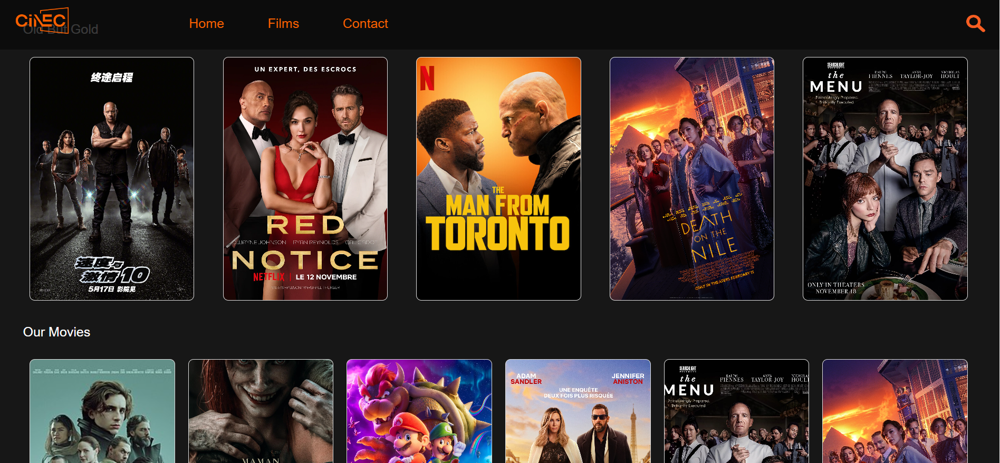
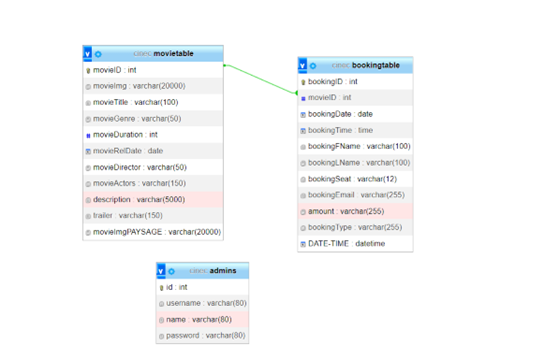

# CineC : Movie Ticket Booking System

## Description  :
Back-end coded with PHP and front-end coded with Bootstrap, CSS, HTML, and Javascript and used MySql in the database.

## Tools and Versions : 

 1.  WAMPSERVER  3.3.0 64 bit 
 2.	PhpMyAdmin : 5.2.0 
 3.	PHP : 7.4.33
 4.	MySQL : 8.0.31
## Installation : 

1)	Open PhpMyAdmin .
2)	Import cinec.sql .
3)	Open ConnexionDB.php and update Data Base Name and Password.

Admin Login Informations :
1)	Username : Meryem
2)	Password : 123

## DataBase Diagram :

